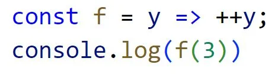
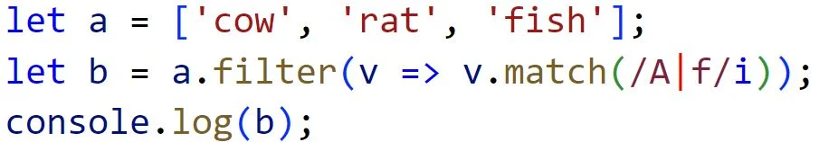
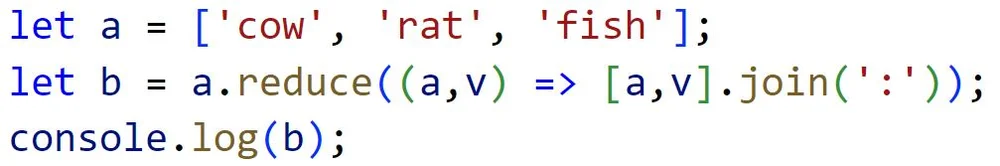
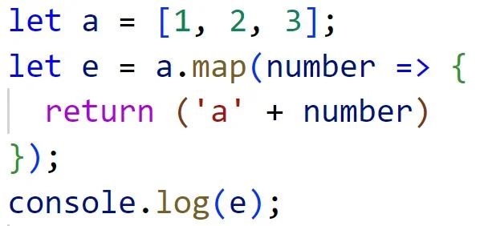
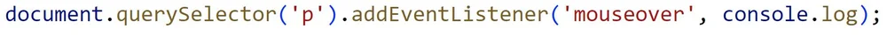
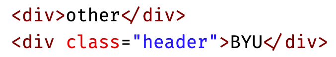
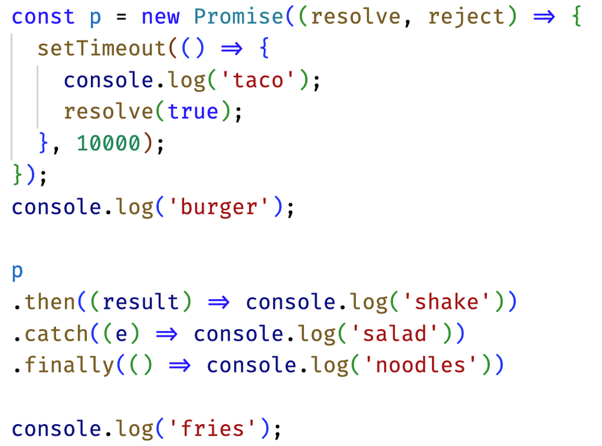
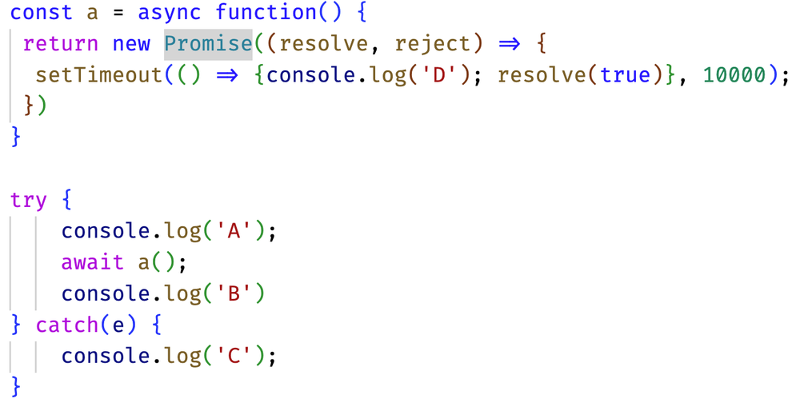

# Class Notes #

### Git ###
- Here are some of the main git functions:
  - git push
  - git pull
  - git commit -am "merge(notes) combined both edits"
  - git clone
  - git add (before commit and push)
  - git fetch 
  - git status

### Useful Bash Commands ###
* Curl - command line client url browser
* Find - find files
* Top - view running processes
* Df - view disk statistics
* Ps - view processes
* Ping - test connection
* Tracert - trace network
* Dig - DNS information
* Ctrl + r = recall command
* Ctrl + z = background task

### Spacing in CSS ###
Px	Number of pixels
Pt	The numbe of points 1/72 of an inch
%	A percent of the parent element
Em	A multiplier of the width of the letter m in the parent's font
Rem	A multiplier of the width of the letter m in the root's font
Vw	View width percentage
Vh	View height percentage

### Unicode and UTF-8 ###
Unicode and UTF-8
* This came after the 128 bit representation
* 4 bytes for a character
* Unicode it just sorta huge
* Utf-8 is an encoding of Unicode, if it is one byte that means it is Ascii, if there is an escape character, it can 
be in the expanded character set

### CSS Animation Example ###
```Animation
P {
Text--align: center;
Font-size: 20vh;
 
Animation-name: demo;
Animation-duration: 3s;
}
 
@keyframes demo{
From {
Font-size: 0vh;
}
 
95% {
Font-size: 21vh;
}
 
To {
Font-size: 20vh;
}
}
```

### View Styles ###
Meta name = viewport
* Puts you in control for the formatting
* Lets you control scaling, width for rendering
 
Float
* Sticking a floating section somewhere in your page
* Puts it out of the flow
 
Display options:
* None - doesn't render
* Block - Occupy entire width of display by default
* Inline - Occupy only as much width as you need
* Flex - flex object that can sorta turn into a grid
* Grid - makes a grid type object
 
Grid:
* Has a container class then classes for each of the items
* The container is set to display: grid
  * grid-template-columns: repeat(auto-fill, minmax(300px, 1fr);
  * Grid-auto-rows: 300px;
  * Grid gap: 1em;
 
Flex:
* Allows formatting on the website like a small sidebar
* The container:
  * Display: flex;
  * Flex-direction: column;
  * Margin:
  * Height:
* The children:
  * Flex: 0 80px;
  * 0 means don't resize automatically
  * 1 means flex 1 factional unit to this box
  * Display: flex;
  * Flex-direction: row;
    "css flex and grid layout" on codepen"

### Intro to Javascript ###
Types, Operators, conditionals, loops
* Founded by Brendan Eich
* "Always bet on Java script"
* ECMAScript is the real name of Java script
 
JavaScript
* Const words = ['hello', 'world'];
* Words.forEach((word) => console.log(word));
* Functions are a type within the language
 
3 ways to make variables:
* Var x = 1;
* Let y = 1;
* Const z = 'tacos';
 
Equality:
* Use three === signs for testing equality

### Arrays ###
let numbers = [1, 2, 3, 4, 5, 6, 7, 8, 9];

#### Maps ####
console.log(
'map', numbers.map((n) => n * 100)
);

Takes the numbers, multiplies each entry by 100, prints it and adds
it to a map

## The following comes from jsDemo.js ##

#### Reduce ####
console.log(
'reduce', numbers.reduce((a, c) => a + c)
);

accumulates all numbers in the array then prints them out

#### forEach ####
console.log(
'forEach', numbers.forEach((n) => n % 2)
);

determines what is a mod 2 in the array

#### filter ####
console.log(
'filter', numbers.filter((n) => n % 2)
);

#### some ####
console.log(
'some', numbers.some((n) => n > 2)
);

there is at least one thing where an element is greater than 5


### Exceptions ###
try {
} catch (error) {
} finally {
}

### Template literals ###
console.log(\`Template ${'lite' + 'rals'}! ${hello(name)}\`);

### Logical Operators
nullsih - means undefined, null, 0, NaN, "logical OR"
let z;
z ?? (z = x)

### Objects ###
let obj = { obj = {animal: 'fish', count:3}
obj.location = {
  cities: ['utah', 'new york'],
  origin: 'ocean'
};

### More array functions ###
#### Spread ####
let input = [1,2,3];
input = [...input, 4, 5, 6];

### variadic ###
Spread something out in place

const sumAndMultiply = (multiplier, ...numbers) => {
  console.log(numbers);
  return numbers.reduce((a,n) => a + multiplier * n)
}

### Iterators and Tables ###
let beaches = [
  { name: 'sunset', shore: 'north' },
  { name: 'sunrise', shore: 'south' },
];

for (const beach of beaches) {
  if (beach.shore === 'west') break;
  console.log(beach);
}

create a new object and modify it because the old one it immutable
console.table(beaches.map((n) => ({ ...n, island: 'oahu'}));

### Optional Chain ###
console.log(x.r?.() || fallback())

Does X have a function r? if not, do fallback. If r is not defined, don't call it

### Iterators and generators ###
You can create your own iterator

### Destructuring arrays ###
const a = [1,2]
[x] = a (yields 1)
[x, y, z] = a (1 2 undefined)
[x, ,y, ...z] = [1,2,3,4,5,6,7]
console.log(x,y,z); (1, 3, [4,5,6,7])

### destructuring parameters ###
function af([a = 3, b = 'taco'] = []) {
  console.log(a,b);
}
af();
af([20]);

### JSON ###
JSON.stringify(object);
- yields the json string of an object
- functions are lost this way 

JSON.parse(objectText);
- this is how you turn a string to an object

### Javascript DOM manipulation ###
passing in `document` allows you to manipulate the dom

for example this prints the entire dom
``` 
function displayElement(el){
  console.log(el.tagName);
  for (const child of el.children) {
    displayElement(child);
  }
}
```

```
const listElements = document.querySelectorAll('p');

for (const el of listElements) {
  console.log(el.textContent);
}
```

Injecting HTML
```
const el = document.querySelector('#t');
el.innterHTML = '<div class="injected"><b>Hello</b>!</div>';
```

textContent makes sure text does not get executed like javascript, keeps you safe from injection attacks

### Event Handlers ###
<button onclick = 'alert("clicked")'>click me</button>

### local storage ###
allows you to save user data temprarily in the browser
localStorage.setItem
localStorage.getItem

### Closure ###
Closure:
* Contains the state of the stack and all that when the function gets called
* Retains state

### Promises and Async ###
* Javascript is single threaded
* You can have things done in the background though, but these are blocking functions
* So everything must be asynchronous
* There is a main thread that is done, the asynchonous element can be done on the outside and then return
* setTimeout allows you to do a scheduled function
* The call stack is your single thread
* The web api is the block that allows you to do processing on the side
 
Promise
* Pending - currently running asynchronously
* Fulfilled - completed successfully
* Rejected - failed to complete
* Something runs ascyhnronously, then promises to "call back"
* New Promise((resolve, reject) => resolve(true))
* The "THEN" function says what to do with the result
* Train car notation
* placeOrder(order)
  * .then
  * .then
  * .catch
  * .finally
* If anything fails, we go straight to .catch
 
Async/await
* The callbacks became really confusing and difficult
* This does what promises do, but it has it's own baggage
* You can use exception handeling to do the promise
* Rule for using await
  * Top level module function
  * Or
  * Called from an async function

### Midterm Review ###
Things to review:
* Await causes the thread to be blocked
* Regex
* (/A|f/i)
  * I makes it in-case sensitive
  * Then we are looking for a A or f (again, case does not matter)
  * The '/' is the start of the regex expression
* Div is a division element, not a divider
* DOM textContent -> sets the child text for the element
* Proper java notation: {n:1}
* Valid json notation: {"x":3}
* To point to another DNS record, use the following DNS record type: CNAME
  * This loads from another resource but shows the same URL that you typed in
* Div.header -> selects the div element with the class header
* Flex direction - reverse column makes things show up in reverse order but as rows

* Margin: Space around an element
* Border: Line around an element
* Padding: Space around content of selected item
* Content

* Prints 4
* What does div do?
* Creates a division element

* Prints ['rat', 'fish']

* Prints cow:rat:fish

* Prints ['a1', 'a2', 'a3']

* Adds a mouseover event to the p elements
* Valid JS notations:
  * const f = (x) => {}
  * function f(x) {}
  * const f = function(x) {}
* Ways to include Javascript in a file
  * ```<script>1+1</script>```
  * ```<script src='main.js' />```
  * ```<div onclick='1+1' />```
* Valid javascript objects
  * { n:1 }
* invalid Javascript object
  * { n=1 }
  * { "n"=1}
  * { "n"="1" }
* valid JSON object
  * {"x":3}
* invalid JSON objects
  * {x:3}
  * {"x":undefined}
  * {'x':3}
* What does the DOM textContent property do?
  * Sets the child text for the an element
* How to make a valid hyperlink:
  * ```<a href='https://c.com'>x</a>```

* Change only the BYU text to blue
  * div.header { color: blue; }
* How to make something executable
  * chmod +x deploy.sh
* DNS subdomains go at the beginning of a link
* To point at another DNS record, use the following DNS record name:
  * CNAME

  * prints burger fries taco shake noodles

  * prints A D B

## 5.3 Web services & Node.js ##
Ryan Dahl - Created node.js
He dropped out and moved to Chile, then released node.js in 2009

### What is Node.js ###
Wrapped JS in an application to execute it, puts response out to console window
Important things:
* NVM - node version manager
* Node - javaScript runtime
* NPM - Node package manager

npm install - installs what you need to run an application
You want to ignore what you pulled down with your .gitignore

## Deployment and environments ##
### Environments ###
we have the development environment in our IDE integrated with git. Then you have a deploy
script that pushes to production. 

In a more complex environment, you have your development environment, a staging environment
as well as a production environment. Staging allows you to do integration tests.

### Interruptive deployment ###
This is like what we do on the website where things are disrupted as clients could be interacting
on the website. Stop, replace, start, etc

### Rolling drain and replace ###
Multiple servers with load balance - drain, stop, start... repeat.
There are multiple servers with a load balancer, have all requests go to other servers and do one server's work.
There must be compatability between the versions.

### Canary ###
Gradual, put up a small percent of your server on the new version and monitor for errors.

### Blue/green ###
Blue is the current previous release. Green is the new one, you keep them both up in case you need to swap

### A/B ###
used for evaluating if a feature is good. Route some percent of the traffic using DNS
to the new environment, do some evaluation, then decide if it will become the new feature.
Some customers get one version, versus another.

## Storage ##
### Uploading files to the server ###
Frontend - file input
backend - multer

frontend:
```angular2html
<input
    type="file"
    id="fileInput"
    name="file"
    accept=".png, .jpeg, jpg"
    onchange="uploadFile(this)"
>
```
The rest are in the slides

multer limits are for max file size, in bytes

Don't store state on a server. Servers are transient. 

To handle storage use S3, 

## OWASP 10 ##
Open worldwide application security project

Top 10 security flaws:
1) Broken Access Control
- Least privilege access violation
- URL bypass control (/payment:accountId)
- Resource path allows access (../../../etc/password)
2) Cryptographic Failures
- Transmitting data as clear text
- Not encrypting at rest or transit
- Weak cryptography (SHA1, MD5)
- Misused cryptography (no salt, wrong params)
3) Injection attack
- Not sanitizing data and users and inject plaintext database attacks
4) Insecure design
- Not aware of best practices
- Unlimited trial accounts
- Customer data not segmented
- single layer defense
5) Security misconfiguration
- development info exposed
- using default configurations
- unnecessary features installed
- system not hardened
6) Vulnerable Components
- Unnecessary/unused packages imported
- Untrusted/verified sources
- Out of data software
- Not tracking vulnerability bulletins
- Package versions not locked
7) ID and Auth Failures
- Credential stuffing (compromised list)
- Brute force attacks (guess a password)
- Permitting weak passwords
- Weak credential recovery
- Credentials in URL
- Not expiring auth tokens
8) Software Integrity Failures
- unverified CDN usage
- unverified packages (npm install)
- unverified updates
- Unsecure CD/CI platforms
9) logging failures
- not logging critical requests
- not monitoring system performance
- logs not audited, automatic or manual
- logs not stored centrally
- no real-time response
10) server side request forgery
- servers have to execute a URL to get an image, or outside resource. Instead we can inject a URL with data we want, 
then we can make the server execute this.
